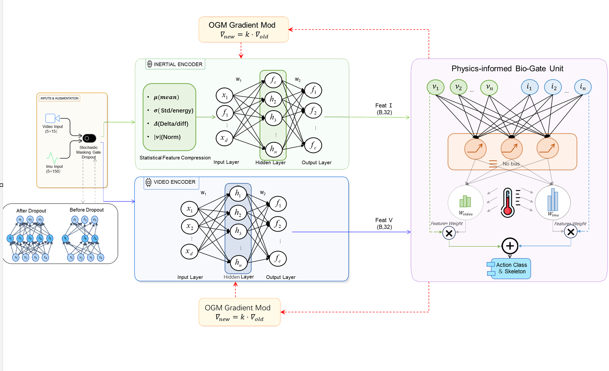
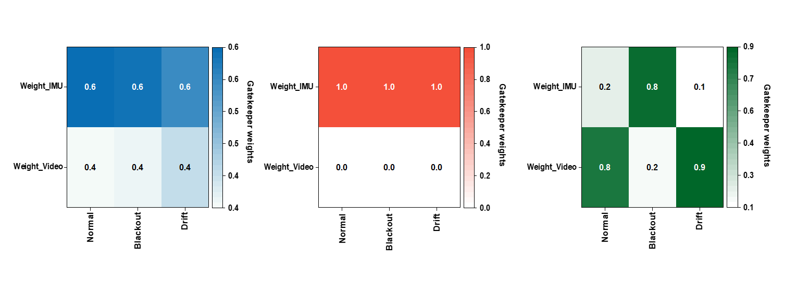

# Physics-Informed Bio-Gated Fusion (PI-BGF) for Robust HAR
[]()
[]()

> Official PyTorch implementation for **Robust Multimodal Human Activity Recognition (Vision + IMU)** under severe sensor corruption (e.g., Camera Occlusion, IMU Drift).

## 🧠 1. Core Architecture (PI-BGF)
Our proposed architecture explicitly enforces physical causality (Zero Input -> Zero Response) through a Bias-Free linear layer and Low-Temperature Softmax, isolating catastrophic sensor failures effectively.

<div align="center">
  
</div>

## 📊 2. Dynamic Gating Mechanism & Trajectory Tracking
The model achieves **>96% accuracy** under severe sensor corruption, drastically outperforming traditional attention mechanisms.

* **Left / Gating Weights**: Visualizes the internal weight allocation under Normal, Blackout, and Drift conditions. Our PI-BGF strictly suppresses the corrupted modality weight to nearly `0.0`, proving the effectiveness of the Bias-Free physical constraint.
* **Right / Trajectory Reconstruction**: Under severe IMU drift, the baseline model fails and oscillates, while our Fusion model (red line) successfully isolates the drift and reconstructs the high-fidelity motion path aligned with the Ground Truth.

<div align="center">
  
  
</div>

## 🚀 3. Quick Inference Demo
To verify the architecture and tensor flow without training from scratch, run the inference demo with dummy data:

```bash
git clone https://github.com/asfasdasfd7-hash/PI-BGF-Net.git
cd PI-BGF-Net
pip install -r requirements.txt

# Run the Forward Pass Demo
python demo_inference.py --model final
