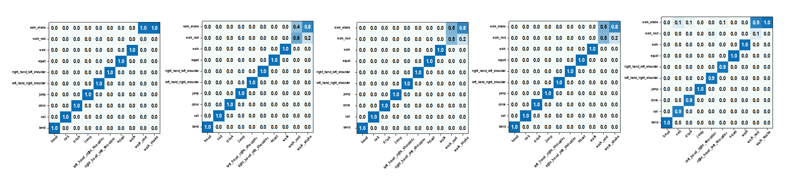
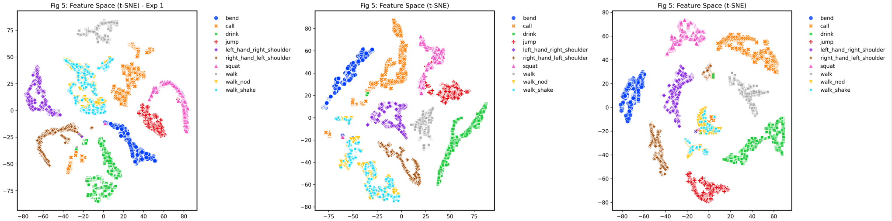

# Physics-Informed Bio-Gated Fusion (PI-BGF) for Robust HAR
[]()
[]()

> Official PyTorch implementation for **Robust Multimodal Human Activity Recognition (Vision + IMU)** under severe sensor corruption (e.g., Camera Occlusion, IMU Drift).

## 🧠 1. Core Architecture (PI-BGF)
Our proposed architecture explicitly enforces physical causality (Zero Input -> Zero Response) through a Bias-Free linear layer and Low-Temperature Softmax, isolating catastrophic sensor failures effectively.

<div align="center">
  
</div>

## ⚙️ 2. Dynamic Gating Mechanism (Mechanism Verification)
Visualizes the internal weight allocation under Normal, Blackout, and Drift conditions. Our PI-BGF strictly suppresses the corrupted modality weight to nearly `0.0`, proving the effectiveness of the Bias-Free physical constraint.

<div align="center">
  
</div>

## 📊 3. Robustness & Feature Discriminability (Final Results)
The model achieves **>96% accuracy** under severe sensor corruption, drastically outperforming traditional attention mechanisms.

* **Top / Confusion Matrices**: Demonstrates structurally invariant diagonal sharpness even when subjected to Visual Jitter, IMU Noise, or Visual Blackout.
* **Bottom / t-SNE Visualization**: Shows highly distinct and well-separated feature manifolds learned by the PI-BGF mechanism, proving corruption-invariant representation.

<div align="center">
  <br><br>
  
</div>

## 🚀 4. Quick Inference Demo
To verify the architecture and tensor flow without training from scratch, run the inference demo with dummy data:

```bash
git clone https://github.com/YourUsername/PI-BGF-Net.git
cd PI-BGF-Net
pip install -r requirements.txt

# Run the Forward Pass Demo
python demo_inference.py --model final
